# Setting Up and Running Roomatinder

This document provides comprehensive instructions for deploying and running Roomatinder on a Google Cloud Compute VM instance, the environment used for class demonstrations. If deploying on a different platform, some steps may differ or may be unnecessary.

## Firebase Project
Roomatinder leverages Google Firebase for managing user data and accounts. To configure your Firebase project, navigate to [Firebase Console](https://console.firebase.google.com/).

In the Firebase Console, select **Create a new Firebase project**. Provide a project name (e.g., "Roomatinder"), then click **Continue** and **Create Project**.

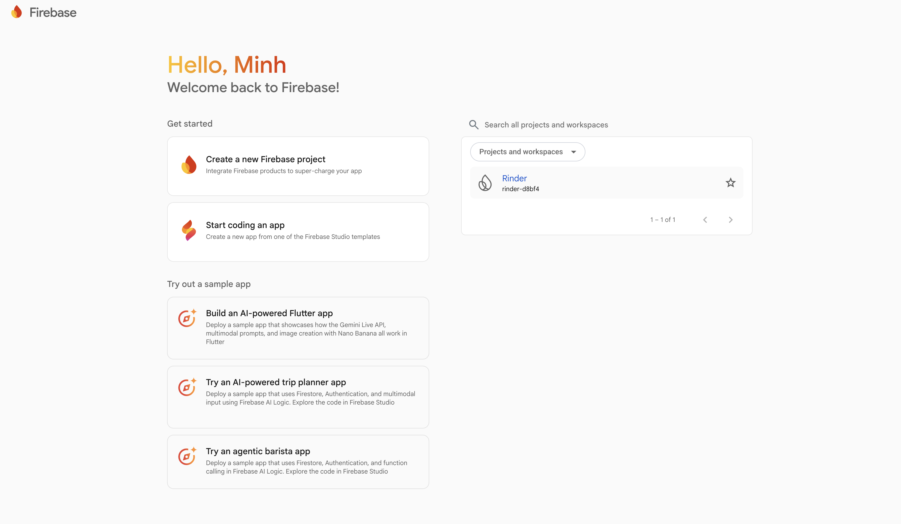
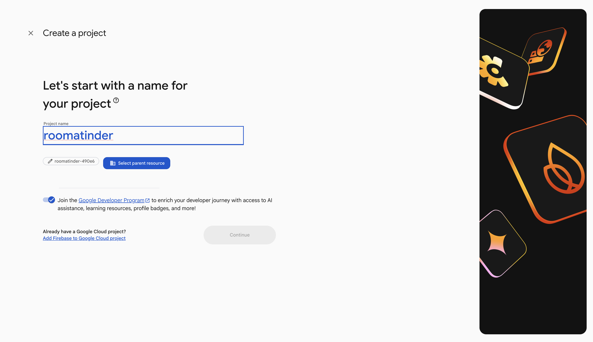

## Firestore Database
Within the Firebase Console, select your project. In the left-hand panel, click **Build** and choose **Firestore Database**.

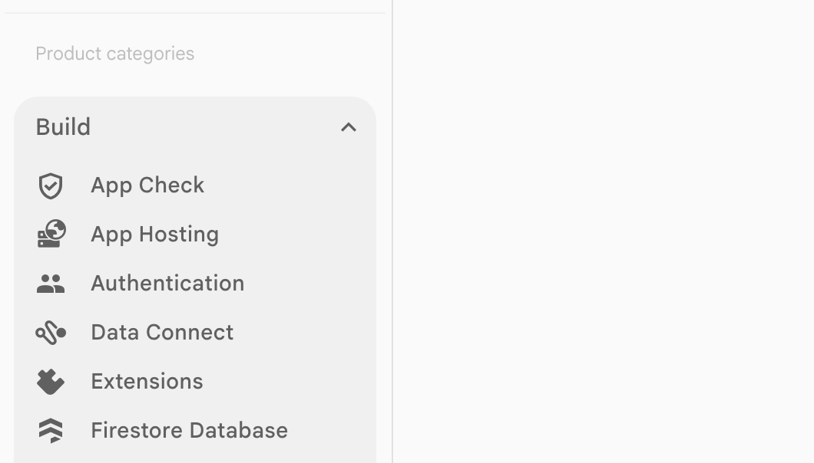

When prompted, click **Create database**.

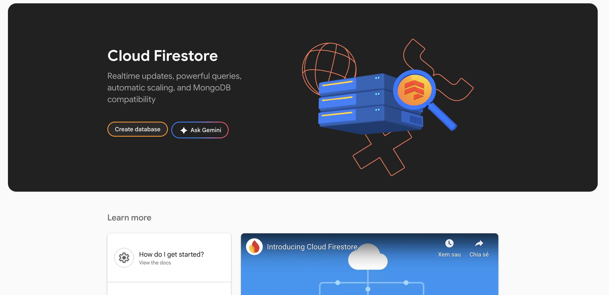

Select **Standard edition**.

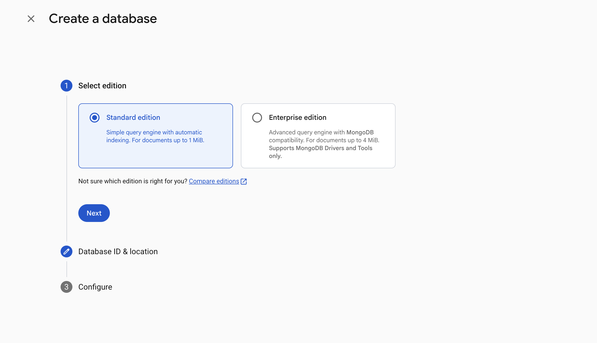

Choose your preferred region (the default, `nam5`, is recommended).

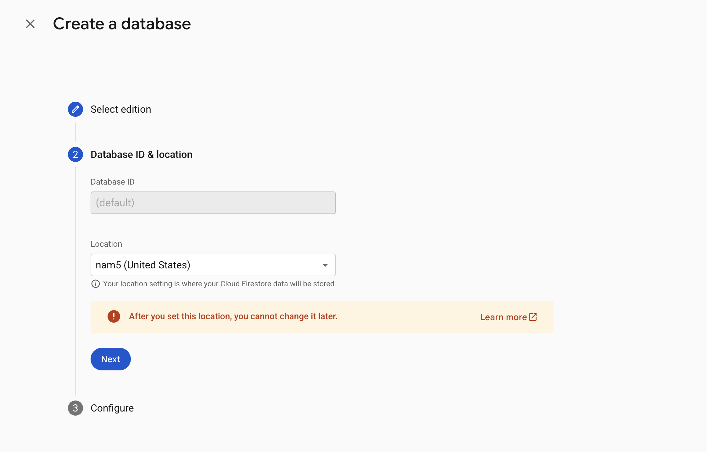

Select **Start in production mode** and click **Create**. The database setup process may take a few moments.

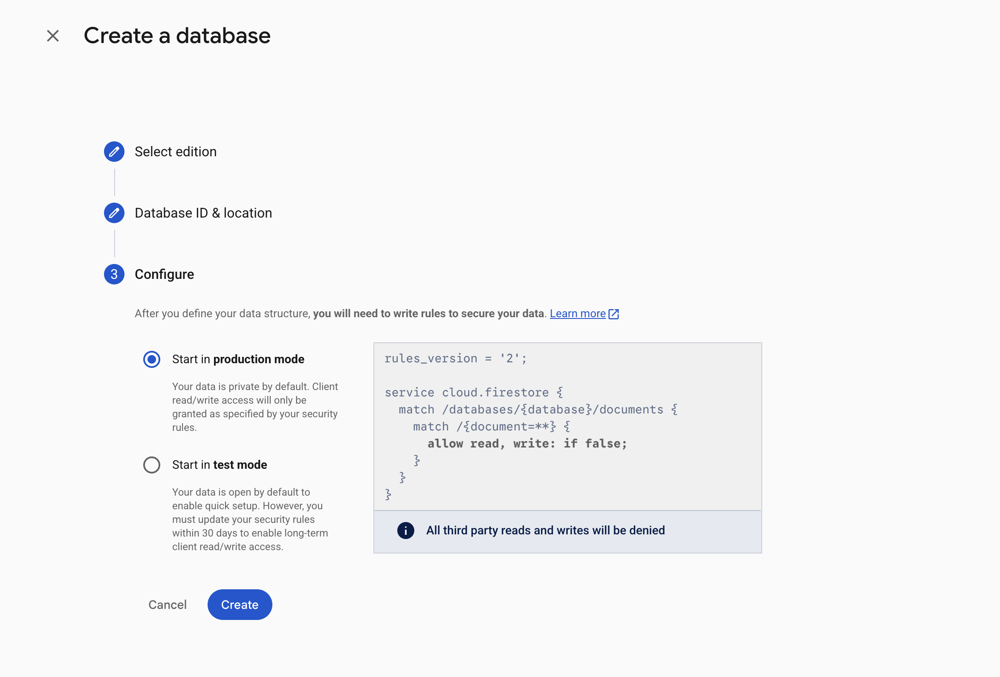

Once the database is ready, navigate to the **Rules** tab in **Firestore Database**.

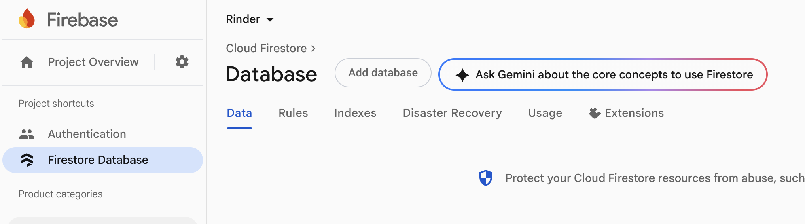

Insert the following rules into the editor and click **Continue**:

```
rules_version = '2';
service cloud.firestore {
  match /databases/{database}/documents {
    match /{document=**} {
      allow read, write: if true;
    }
  }
}
```

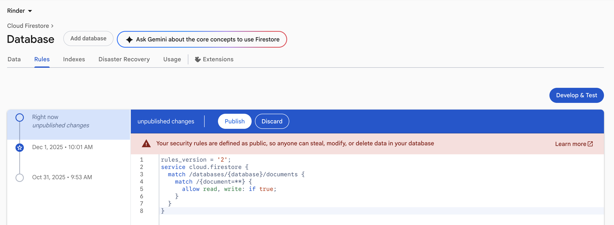

These rules permit unrestricted read and write access to the Firestore database. Because Roomatinder is a Minimum Viable Product (MVP), comprehensive access controls have not been implemented; use these rules with caution.

## Setting Up a Google Cloud VM

**Guidance:** The instructions in this section are specific to GCP. If you use another VPS provider, follow that provider's VM creation and networking documentation; the high-level steps (create VM, select OS image, configure networking and security) are analogous. For local development, a VM is not required — run the application with `npm run dev` or `npx next start -p 3000` and access it at `http://localhost:3000`.

Begin by visiting the [Google Cloud Console](https://console.cloud.google.com/welcome/new).

In the top menu, click **Select a project** and choose the project you created earlier.

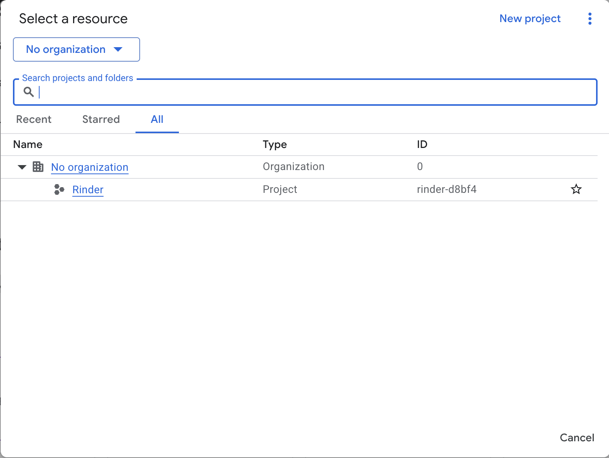

Click **Create a VM**.

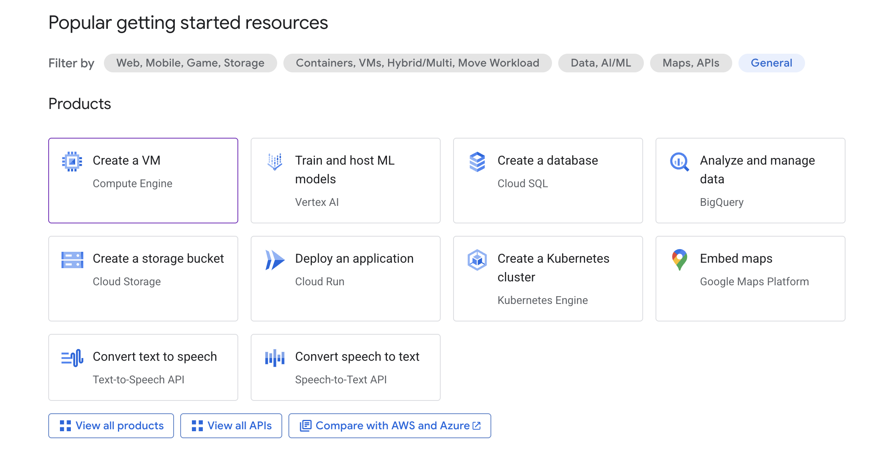

In the VM creation pane, under **Machine configuration**, use the default settings or adjust the hardware specifications as needed.

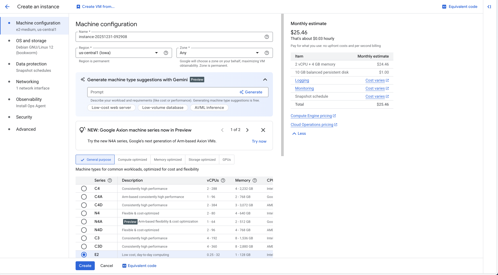

Navigate to the **OS and storage** tab. Set the **Image** to Ubuntu or Debian. You may increase the storage size if required; however, the default 10GB is typically sufficient.

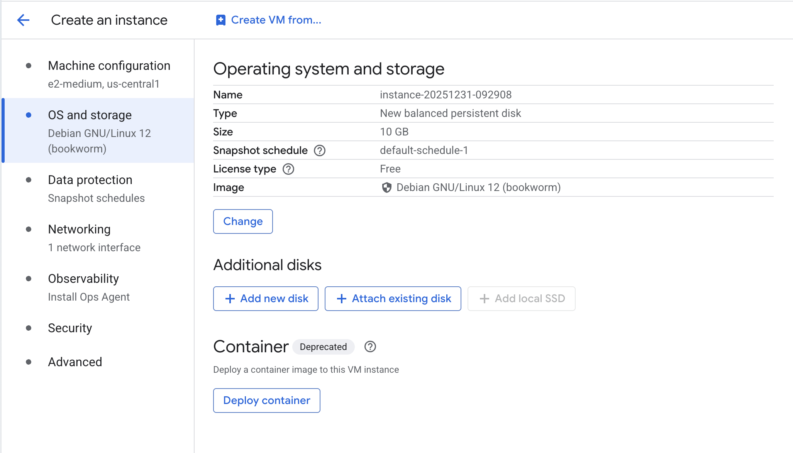

In the **Networking** tab, enable **Allow HTTP traffic**, **Allow HTTPS traffic**, and **IP forwarding**. Ensure the **Network interface** is set to `nic0 default`.

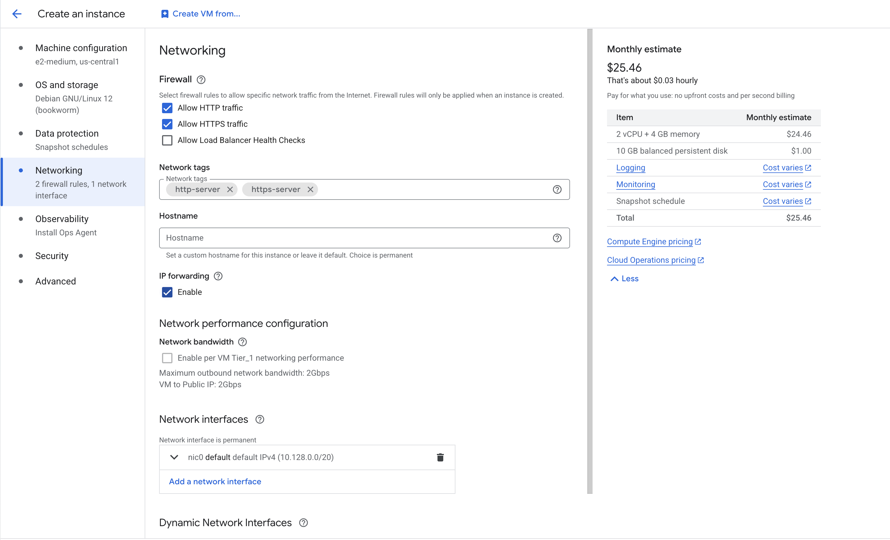

In the **Security** tab, select **Allow full access to all Cloud APIs**.

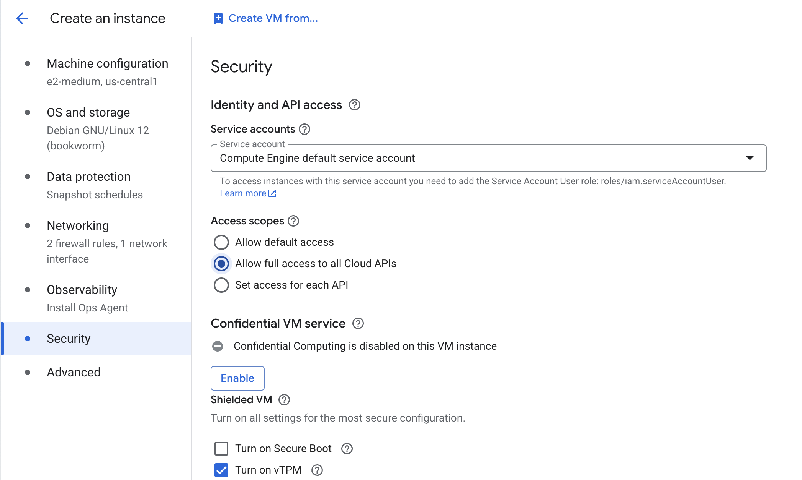

Click **Create** to launch your VM.

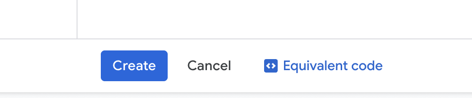

After the VM is created, navigate to [Compute Instances](https://console.cloud.google.com/compute/instances) to view the list of VM instances. Click the **SSH** button next to your new VM to establish a connection.

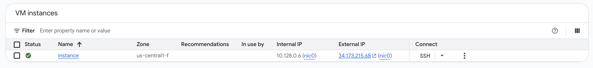

## Installing Required Packages

### Python and Pip
**Note:** The commands below assume an Ubuntu/Debian environment. For other Linux distributions adapt the package manager (for example, `yum`, `dnf`, or `pacman`); on macOS prefer using Homebrew; and on Windows consider using WSL or the official installers.

First, update and upgrade your system using the following commands:

```
$ sudo apt update
$ sudo apt -y upgrade
```

Ubuntu and Debian typically include Python 3 pre-installed. Verify your Python version:

```
$ python3 -V
```

Ensure the Python interpreter is version 3.11 or later. If necessary, upgrade to a newer Python version using the commands below:

```
$ sudo apt update
$ sudo apt install -y build-essential libssl-dev zlib1g-dev libbz2-dev libreadline-dev libsqlite3-dev libncursesw5-dev libffi-dev liblzma-dev uuid-dev libgdbm-dev libnss3-dev libedit-dev tk-dev wget curl ca-certificates

$ VERSION=3.13.1
$ wget https://www.python.org/ftp/python/${VERSION}/Python-${VERSION}.tgz
$ tar -xf Python-${VERSION}.tgz
$ cd Python-${VERSION}
$ ./configure --enable-optimizations --with-lto --enable-shared
$ make -j"$(nproc)"
$ sudo make altinstall

$ grep -qxF 'alias python3=python3.13' ~/.bashrc || echo 'alias python3=python3.13' >> ~/.bashrc && source ~/.bashrc
```

Install pip (Python's package manager) with the following command:

```
$ sudo apt install -y python3-pip
```

### Node.js
**Note:** These instructions target Unix-like systems (Linux/macOS). On Windows, use the [official Node.js installer](https://nodejs.org/en/download).

Install Node.js using the following commands:

```
$ curl -o- https://raw.githubusercontent.com/nvm-sh/nvm/v0.40.3/install.sh | bash
$ \. "$HOME/.nvm/nvm.sh"
$ nvm install 24
```

After installation, verify the versions:

```
$ node -v
$ npm -v
```

The output should display `v24.x.x` for Node.js and `11.x.x` for npm.

If the system reverts to an older version of Node.js and npm after restarting the shell, execute the following commands:

```
$ \. "$HOME/.nvm/nvm.sh"

$ NODE_PATH=$(which node)
$ NPM_PATH=$(which npm)
$ NPX_PATH=$(which npx)

$ grep -qxF 'alias node=${NODE_PATH}' ~/.bashrc || echo 'alias node=${NODE_PATH}' >> ~/.bashrc
$ grep -qxF 'alias npm=${NPM_PATH}' ~/.bashrc || echo 'alias npm=${NPM_PATH}' >> ~/.bashrc
$ grep -qxF 'alias npx=${NPX_PATH}' ~/.bashrc || echo 'alias npx=${NPX_PATH}' >> ~/.bashrc
```

## Cloning the Repository
Clone the Roomatinder repository and install its dependencies:

```
$ git clone https://github.com/tohuu123/Roomatinder
$ cd Roomatinder
```

Install the required packages:

```
$ npm install
```

## Setting Up ChromaDB

**Note:** If you are using Chroma Cloud rather than a local ChromaDB instance, set your Chroma Cloud host URL in the `CHROMA_HOST` variable in the `.env` file and omit the remaining ChromaDB setup steps in this guide. Ensure any required network or authentication configuration for Chroma Cloud is completed separately.

To install ChromaDB, execute the following command:

```
$ npm run chroma-install
```

**Note:** ChromaDB relies on native dependencies and may be sensitive to operating system and CPU architecture. Consult the *Building the project* section for troubleshooting steps if platform- or architecture-related errors occur.

If you are using a Windows host, use the following command instead:

```
$ npm run chroma-install:win
```

## Configuring Environment Variables
In the project root directory, create a `.env` file with the following content:

**Note:** For local development, use a `.env.local` file or similar developer-specific configuration and avoid committing secrets to version control. On headless servers (for example, a cloud VM), edit the `.env` file using a terminal editor such as `nano` or `vim`.

```
AUTH_COOKIE_NAME=Roomatinder
AUTH_COOKIE_SIGNATURE_KEY_CURRENT=RoomatinderSecret
AUTH_COOKIE_SIGNATURE_KEY_PREVIOUS=RoomatinderSigPrev

USE_SECURE_COOKIES=false

FIREBASE_ADMIN_CLIENT_EMAIL=
FIREBASE_ADMIN_PRIVATE_KEY=

NEXT_PUBLIC_FIREBASE_PROJECT_ID=
NEXT_PUBLIC_FIREBASE_API_KEY=
NEXT_PUBLIC_FIREBASE_AUTH_DOMAIN=
NEXT_PUBLIC_FIREBASE_DATABASE_URL=
NEXT_PUBLIC_FIREBASE_MESSAGING_SENDER_ID=
NEXT_PUBLIC_FIREBASE_STORAGE_BUCKET=
NEXT_PUBLIC_FIREBASE_APP_ID=
NEXT_PUBLIC_FIREBASE_MEASUREMENT_ID=

NEXT_PUBLIC_PERSONA_TEMPLATE_ID=
PERSONA_API_KEY=
NEXT_PUBLIC_PERSONA_ENVIRONMENT=sandbox

NEXT_PUBLIC_GEMINI_API_KEY=

NEXT_PUBLIC_MAPBOX_ACCESS_TOKEN=

EMAIL_SERVICE=gmail
EMAIL_USER=
EMAIL_PASSWORD=

CRON_SECRET=E+lTsLGuThJ0oreXe9KY/3VY8ZgY0+3xEPihCfMp0j4=
ENABLE_CRON=true
```

### Firebase Environment Variables
In your Firebase project, click the gear icon next to **Project Overview** in the left-hand panel, then select **Project settings**.

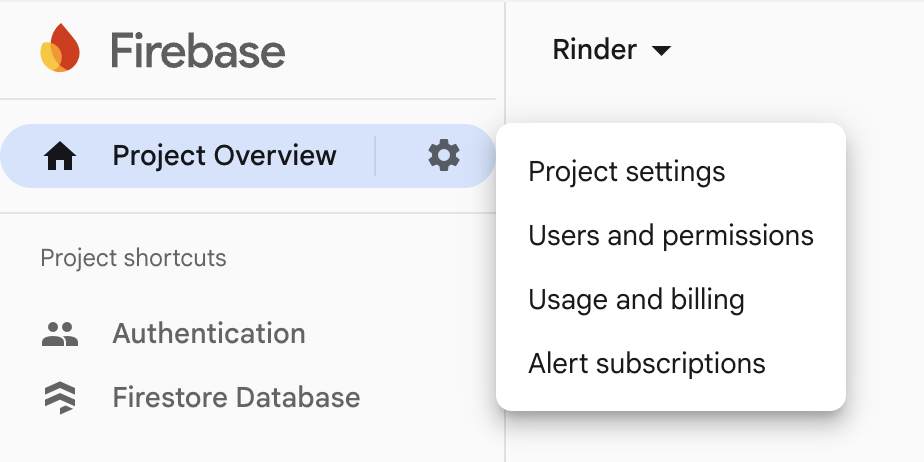

Under the **General** tab, scroll to the **Your apps** section.

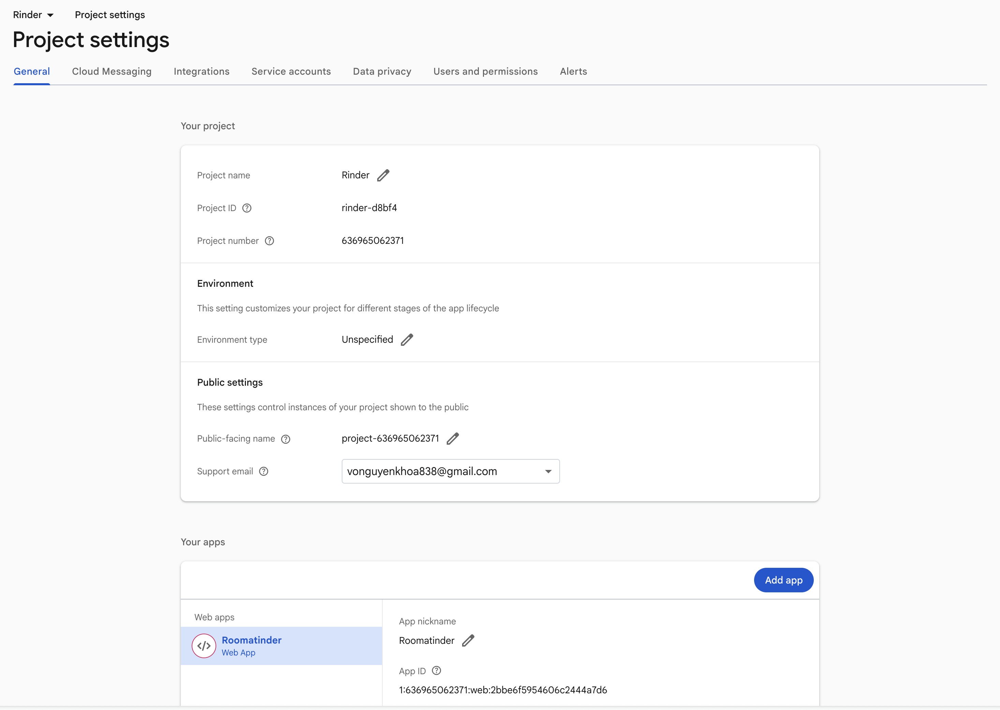

Locate the `firebaseConfig` object in the code block. Copy each value into the corresponding variable in your `.env` file as follows:

```
NEXT_PUBLIC_FIREBASE_API_KEY=
NEXT_PUBLIC_FIREBASE_AUTH_DOMAIN=
NEXT_PUBLIC_FIREBASE_PROJECT_ID=
NEXT_PUBLIC_FIREBASE_STORAGE_BUCKET=
NEXT_PUBLIC_FIREBASE_MESSAGING_SENDER_ID=
NEXT_PUBLIC_FIREBASE_APP_ID=
NEXT_PUBLIC_FIREBASE_MEASUREMENT_ID=
```

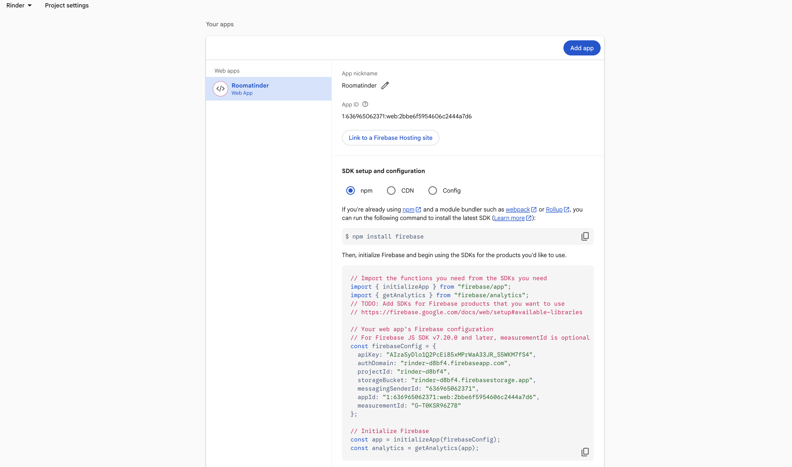

Next, navigate to the **Service accounts** tab and click **Generate new private key**.

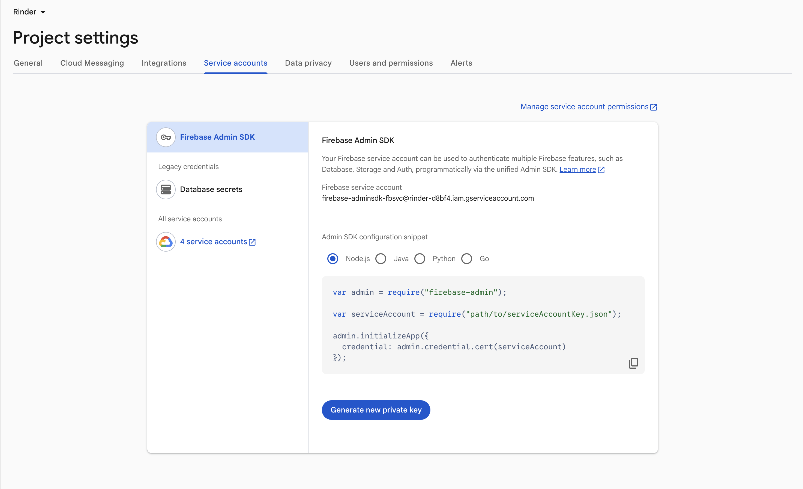

A JSON file will be downloaded automatically. Open the file and copy the `client_email` and `private_key` values into the `FIREBASE_ADMIN_CLIENT_EMAIL` and `FIREBASE_ADMIN_PRIVATE_KEY` fields in your `.env` file.

**Important:** Remove all line breaks from the `FIREBASE_ADMIN_PRIVATE_KEY` value to avoid Firebase service account JSON errors.


### Persona Environment Variables
Roomatinder uses Persona for user verification via biometrics and ID cards. First, sign up at https://withpersona.com/.

After registering, fill out the forms to select a verification solution. For best results, choose **Conduct user verification** so the **KYC solution** is selected automatically.

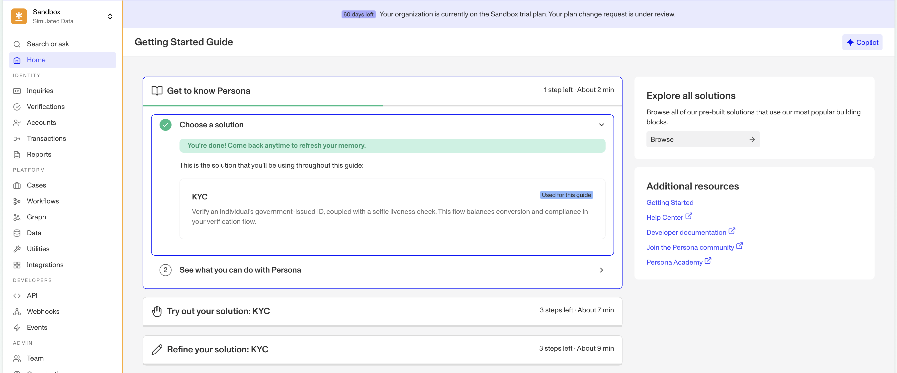

Click **Integrate with your product**.

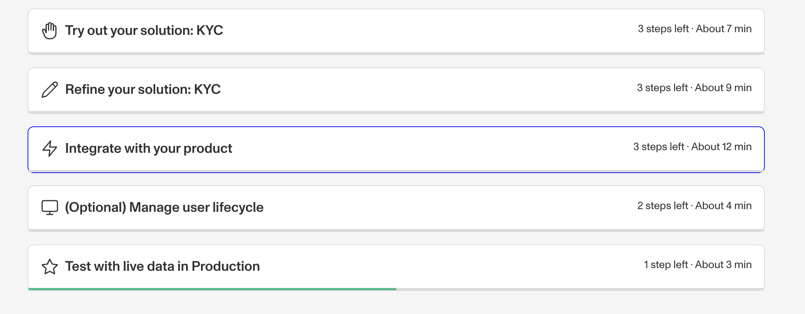

Select **Embedded Flow**, then click **View Embedded Flow integration guide**.

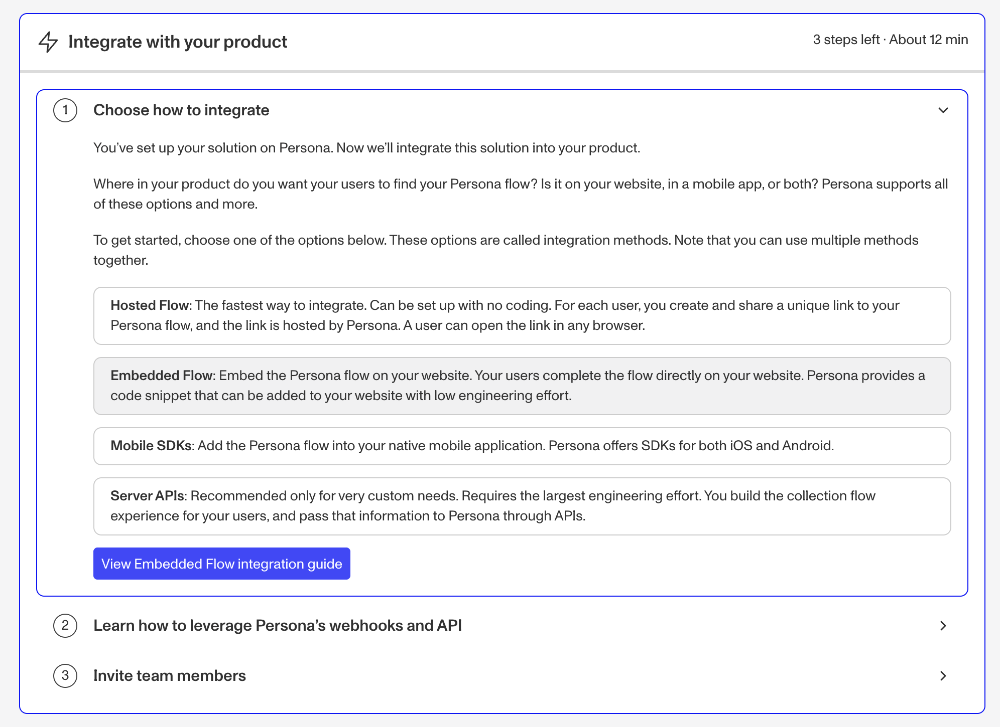

You'll be taken to a **Getting Started** page.

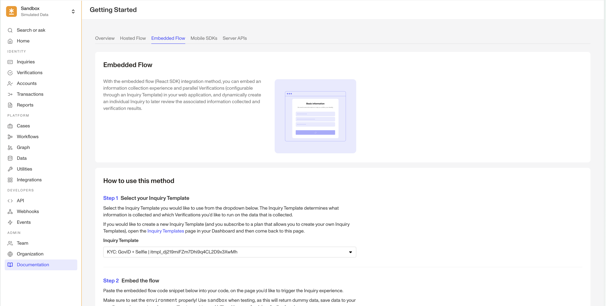

Scroll down to the code snippet. Copy the `templateId` value into the `NEXT_PUBLIC_PERSONA_TEMPLATE_ID` variable in your `.env` file.

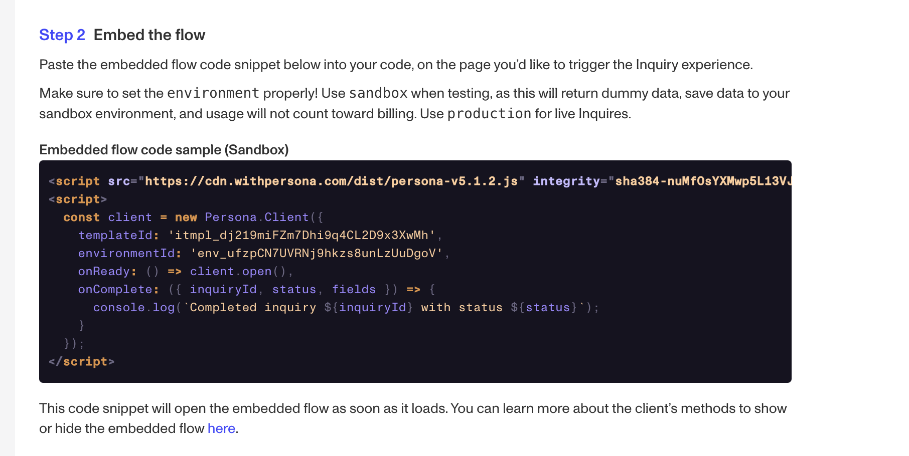

In the left panel, select **API** under the **Developers** section.

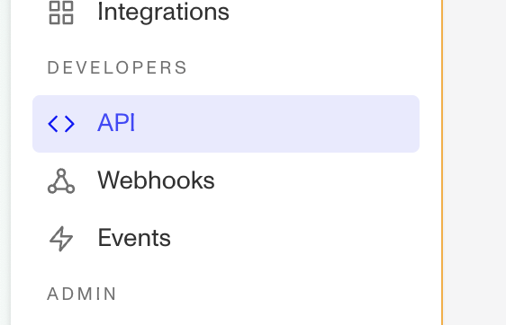

Click **Copy** next to the **Default API key** and paste it into the `PERSONA_API_KEY` variable.

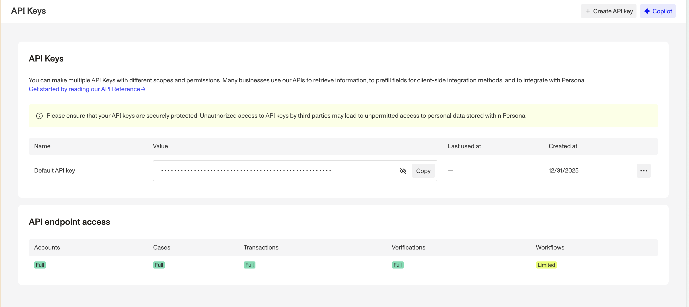

You can use the default API key or create a new one—either works.


### Gemini API Key
Roomatinder uses the Gemini API for all AI features, including message suggestions and profile summaries.

Go to Google AI Studio at https://aistudio.google.com/. In the left panel, click **Get API key**. Then, click **Copy** next to the **Default Gemini Project** API key and paste it into `NEXT_PUBLIC_GEMINI_API_KEY` in your `.env` file.

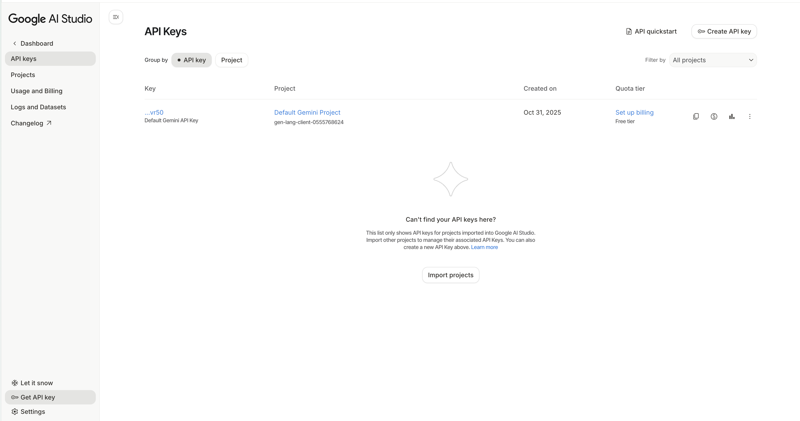

You can use either the default project/API key or create a new one—both options work.


### Email Configuration
Roomatinder can send weekly or daily emails and notifications. **Currently, only Gmail is supported for sending emails.**

Enter the email address you want to use for sending emails in the `EMAIL_USER` variable.

Next, go to your Google account's Two-factor Authentication settings at https://myaccount.google.com/signinoptions/twosv. Make sure you're signed in with the same account as `EMAIL_USER`.

Scroll to the App Password section and click the chevron to expand it.

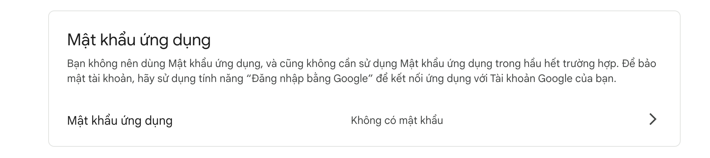

Name your app password (e.g., "Roomatinder") and click **Create**.

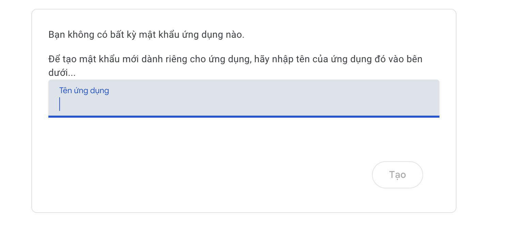

Copy the generated app password and paste it into the `EMAIL_PASSWORD` variable in your `.env` file.

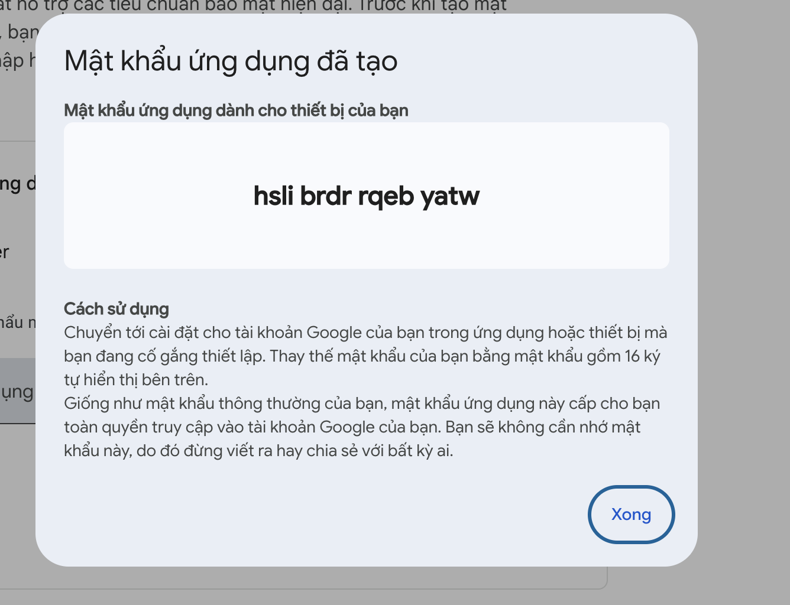


### Mapbox Access Token
Go to https://www.mapbox.com/ and create an Individual account.

In the Mapbox Console (https://console.mapbox.com/account/access-tokens/), click **Tokens** in the left panel. Copy the **Default public token** and paste it into the `NEXT_PUBLIC_MAPBOX_ACCESS_TOKEN` variable.

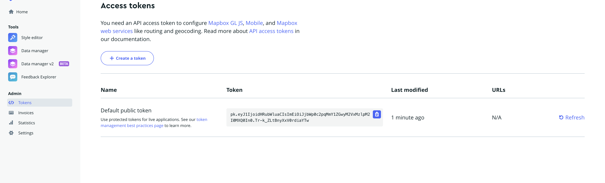

You can use the default token or create a new one—either works.


## Building the Project

Before running Roomatinder in production mode, you need to build the project. Run:

```
$ npm run build
```

In some cases, you might encounter the error **"Error: Unsupported architecture: x64. Only ARM64 is supported."** To fix this, follow the instruction found here: https://github.com/chroma-core/chroma/issues/5188

## Configuring PM2
PM2 is recommended for VPS or production deployments to run services in the background. For local development, running the application in the foreground (for example with `npm run dev` or `npx next start -p 3000`) is typically sufficient.

To begin using PM2, install it globally:

```
$ npm install -g pm2@latest
```

Start ChromaDB in the background:

```
$ pm2 start npm --name chroma -- run launch-chroma
```

If you are running on a Windows host, run this command instead:

```
$ pm2 start npm --name chroma -- run launch-chroma:win
```

Then, start the Next.js web server:

```
$ pm2 start /usr/bin/bash --name roomatinder -- -c "npx next start -H 0.0.0.0 -p 3000"
```

Check that both services are running:

```
$ pm2 ls
```

You should see output similar to:

```
┌────┬───────────────┬──────────┬──────┬─────────┬──────────┬──────────┐
│ id │ name          │ mode     │ ↺    │ status  │ cpu      │ memory   │
├────┼───────────────┼──────────┼──────┼─────────┼──────────┼──────────┤
│ 1  │ chroma        │ fork     │ 0    │ online  │ 10%      │ 351.2 mb │
│ 2  │ roomatinder   │ fork     │ 0    │ online  │ 26%      │ 462.3 mb │
└────┴───────────────┴──────────┴──────┴─────────┴──────────┴──────────┘
```

To view logs, run:

```
$ pm2 logs
```

If everything is working, you should see output like this for ChromaDB:

```
1|chroma   | > roomatinder@0.1.0 launch-chroma
1|chroma   | > cd chromadb && . chroma-env/bin/activate && chroma run --path ../chroma-data --port 8000
1|chroma   |
1|chroma   |   *       .                                     *              .
1|chroma   |   .                 (((((((((    (((((####              *
1|chroma   |     *            ((((((((((((((((((((((#########    .
1|chroma   |   .            ((((((((((((((((((((((((###########        *
1|chroma   |       *      ((((((((((((((((((((((((((############  .
1|chroma   |   *         (((((((((((((((((((((((((((#############
1|chroma   |     .       (((((((((((((((((((((((((((#############     *
1|chroma   |   .          (((((((((((((((((((((((((############## .
1|chroma   |       *      ((((((((((((((((((((((((##############      *
1|chroma   |   *            (((((((((((((((((((((#############   .
1|chroma   |   .      *         (((((((((    #########          .
1|chroma   |       .        *                        .        *           .
1|chroma   | Saving data to: ../chroma-data
1|chroma   | Connect to Chroma at: http://localhost:8000
1|chroma   | Getting started guide: https://docs.trychroma.com/docs/overview/getting-started
1|chroma   | ☁️ To deploy your DB - try Chroma Cloud!
1|chroma   | - Sign up: https://trychroma.com/signup
1|chroma   | - Docs: https://docs.trychroma.com/cloud/getting-started
1|chroma   | - Copy your data to Cloud: chroma copy --to-cloud --all
1|chroma   | OpenTelemetry is not enabled because it is missing from the config.
```

And for the Roomatinder web server:

```
2|roomatinder  |   ▲ Next.js 14.2.5
2|roomatinder  |   - Local:        http://localhost:3000
2|roomatinder  |   - Network:      http://0.0.0.0:3000
2|roomatinder  |  ✓ Starting...
2|roomatinder  |  ✓ Ready in 974ms
```

To generate and configure a startup script, run:

```
$ pm2 startup
```

Follow the on-screen instructions. Then, save the process list so your apps restart automatically after a reboot:

```
$ pm2 save
```

If you are setting up Roomatinder on your machine and just want to run the app locally, visit http://localhost:3000 in the browser to use the app.


## Opening Firewall Ports

**Note:** Opening firewall ports is required for VPS or cloud deployments to allow external traffic; local development on `localhost` typically does not require firewall configuration. The instructions below are specific to GCP; if you use another VPS provider, consult that provider's firewall or networking documentation for equivalent steps.

Navigate to https://console.cloud.google.com/networking/addresses/list. Find the IP address with **External** access type, click the three dots on the right, and select **Promote to static IP address**.

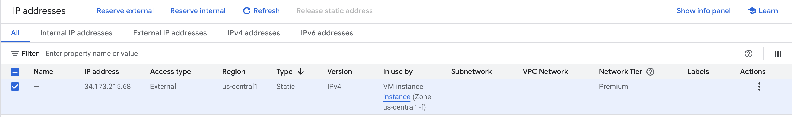

In the dialog, give the address a name (e.g., "external") and click **Reserve**.

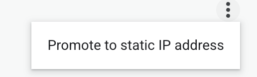

Next, go to https://console.cloud.google.com/net-security/firewall-manager/firewall-policies/list. You will create two new firewall rules to allow both Ingress and Egress traffic on all ports for this IP address.

On the menu bar, click **Create firewall rule**.

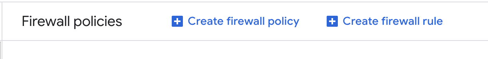

Create an Ingress rule as shown below, then click **Create**.

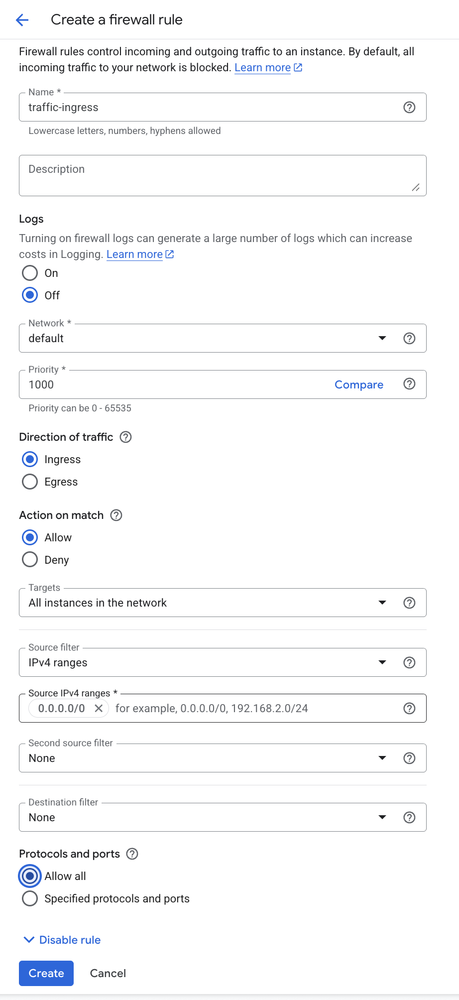

Repeat the process to create an Egress rule:

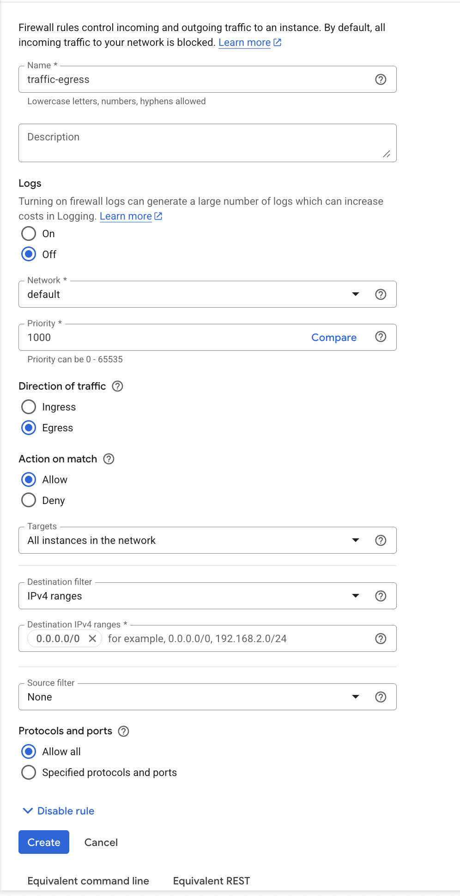

Return to your SSH session and run the following commands to open port 3000:

```
$ sudo ufw allow 3000/tcp
$ sudo ufw reload
$ sudo ufw status
```

If the output includes `3000/tcp                   ALLOW       Anywhere`, the firewall is configured correctly.

You can now access the website at port 3000 using your external IP address!

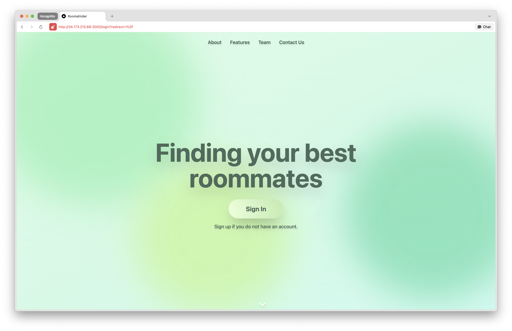

## Configuring Nginx

This section is optional and only needed if you plan to use a custom domain for your app and are deploying to a VPS or server environment. For local development, proxying with Nginx is usually unnecessary — access the application directly at `http://localhost:3000` or use a local tunneling tool (for example, `ngrok`) if external access is required.

First, install and enable Nginx:

```
$ sudo apt update
$ sudo apt install -y nginx
$ sudo systemctl enable --now nginx
```

Create an Nginx configuration file using your preferred editor (e.g., `nano`):

```
$ sudo nano /etc/nginx/sites-available/next.conf
```

Because DNS A records resolve to IP addresses that are reachable over standard HTTP (port 80) and HTTPS (port 443), configure Nginx to proxy traffic from port 80 to the application port (3000). Use the following configuration:

```
server {
    listen 80;
    listen [::]:80;

    location / {
        proxy_pass http://127.0.0.1:3000;
        proxy_http_version 1.1;

        proxy_set_header Upgrade $http_upgrade;
        proxy_set_header Connection $http_upgrade;
        proxy_set_header Host $host;
        proxy_set_header X-Real-IP $remote_addr;
        proxy_set_header X-Forwarded-For $proxy_add_x_forwarded_for;
        proxy_set_header X-Forwarded-Proto $scheme;

        proxy_read_timeout 300;
        proxy_send_timeout 300;
    }
}
```

Enable the configuration and reload Nginx:

```
$ sudo ln -s /etc/nginx/sites-available/next.conf /etc/nginx/sites-enabled/next.conf
$ sudo nginx -t
$ sudo systemctl reload nginx
```

Allow Nginx through the firewall:

```
$ sudo ufw allow 'Nginx Full'
$ sudo ufw reload
$ sudo ufw status
```

Now, visit your external IP address (without :3000). The web app should be available on port 80.

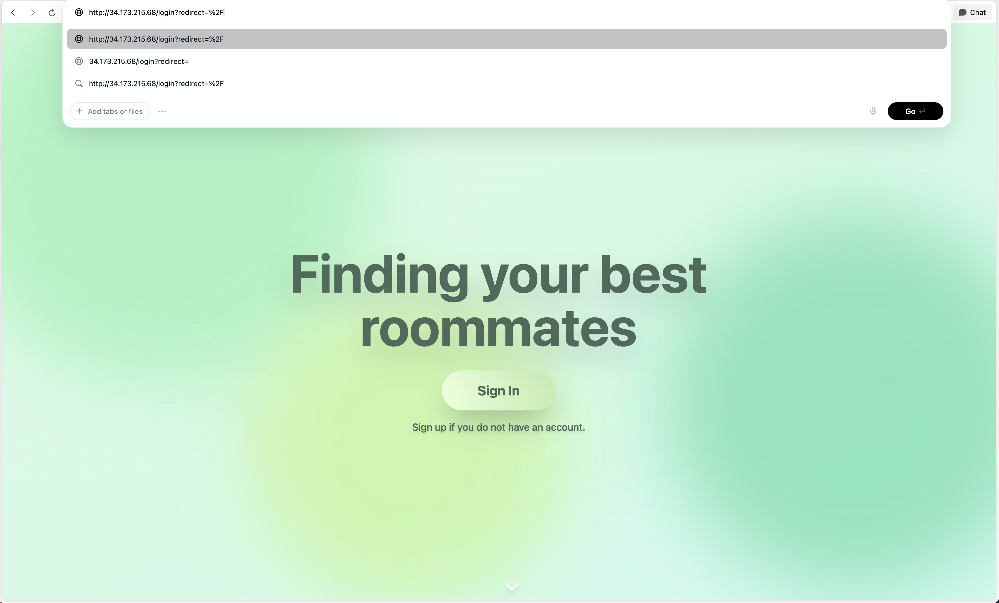

## Setting Up a Custom Domain

This section is optional and only needed if you want to use a custom domain for your app. For local development, DNS changes are generally unnecessary; consider using the hosts file or a tunneling service (for example, `ngrok`) to expose a local server to the Internet for testing.

To use a custom domain, add an A record in your domain's DNS settings that points to your VM's external IP address. For example, with Cloudflare:

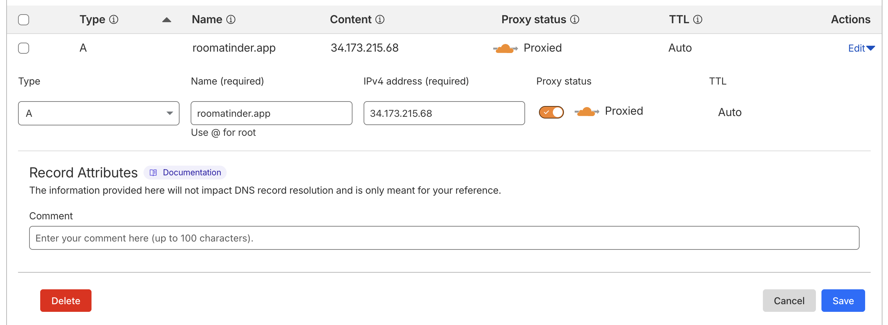

Allow DNS changes a few minutes to propagate. After propagation, Roomatinder will be accessible via the configured custom domain.

For best results, also create an A record for the `www` subdomain pointing to the same external IP address.

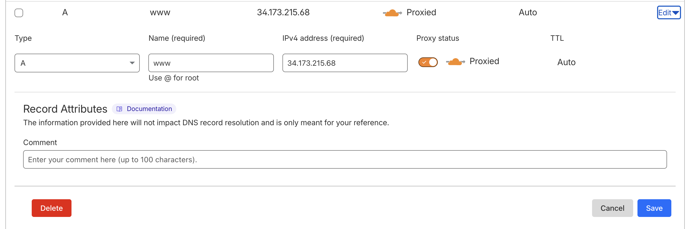

## Setting Up an SSL Certificate

This section is optional and only needed if you want to use a custom domain for your app.

While domain providers may offer SSL certificates, this guide demonstrates obtaining certificates using Let's Encrypt.

First, create the ACME challenge webroot:

```
$ sudo mkdir -p /var/www/letsencrypt
$ sudo chown www-data:www-data /var/www/letsencrypt
```

Install `certbot` and obtain your SSL certificates. Replace `YOUR_EMAIL@example.com` with your actual email address:

```
$ sudo apt install -y certbot
$ sudo certbot certonly \
  --webroot -w /var/www/letsencrypt \
  -d roomatinder.app -d www.roomatinder.app \
  --agree-tos -m YOUR_EMAIL@example.com --non-interactive
```

Edit your Nginx config:

```
$ sudo nano /etc/nginx/sites-available/next.conf
```

Paste the following configuration:

```
server {
  if ($host = www.roomatinder.app) {
    return 301 https://$host$request_uri;
  }

  listen 80;
  listen [::]:80;
  server_name roomatinder.app www.roomatinder.app;

  location /.well-known/acme-challenge/ {
    root /var/www/letsencrypt;
    try_files $uri =404;
  }

  location / {
    return 301 https://$host$request_uri;
  }
}

server {
  listen 443 ssl http2;
  listen [::]:443 ssl http2;
  server_name roomatinder.app www.roomatinder.app;

  ssl_certificate /etc/letsencrypt/live/www.roomatinder.app/fullchain.pem;
  ssl_certificate_key /etc/letsencrypt/live/www.roomatinder.app/privkey.pem;

  ssl_protocols TLSv1.2 TLSv1.3;
  ssl_prefer_server_ciphers on;

  ssl_stapling on;
  ssl_stapling_verify on;

  location / {
    proxy_pass http://127.0.0.1:3000;
    proxy_http_version 1.1;

    proxy_set_header Upgrade $http_upgrade;
    proxy_set_header Connection $http_upgrade;
    proxy_set_header Host $host;
    proxy_set_header X-Real-IP $remote_addr;
    proxy_set_header X-Forwarded-For $proxy_add_x_forwarded_for;
    proxy_set_header X-Forwarded-Proto $scheme;

    proxy_read_timeout 300;
    proxy_send_timeout 300;
  }
}
```

Enable and validate the config:

```
$ sudo ln -s /etc/nginx/sites-available/next.conf /etc/nginx/sites-enabled/next.conf
$ sudo nginx -t
$ sudo systemctl reload nginx
```

Wait a few minutes for the changes to take effect, then visit your custom domain. It should now be accessible via HTTPS.


## Adding a Domain to Firebase Authentication

Return to the Firebase Console. Under **Build**, select **Authentication**, then open the **Settings** tab.

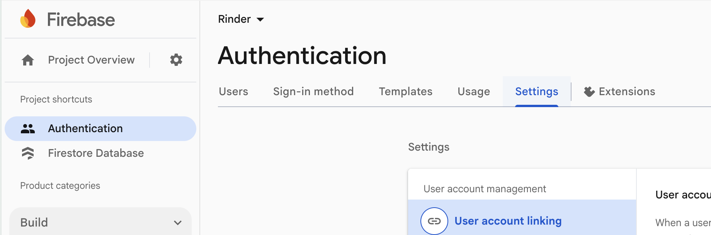

Under **Authorized domains**, click **Add domain**.

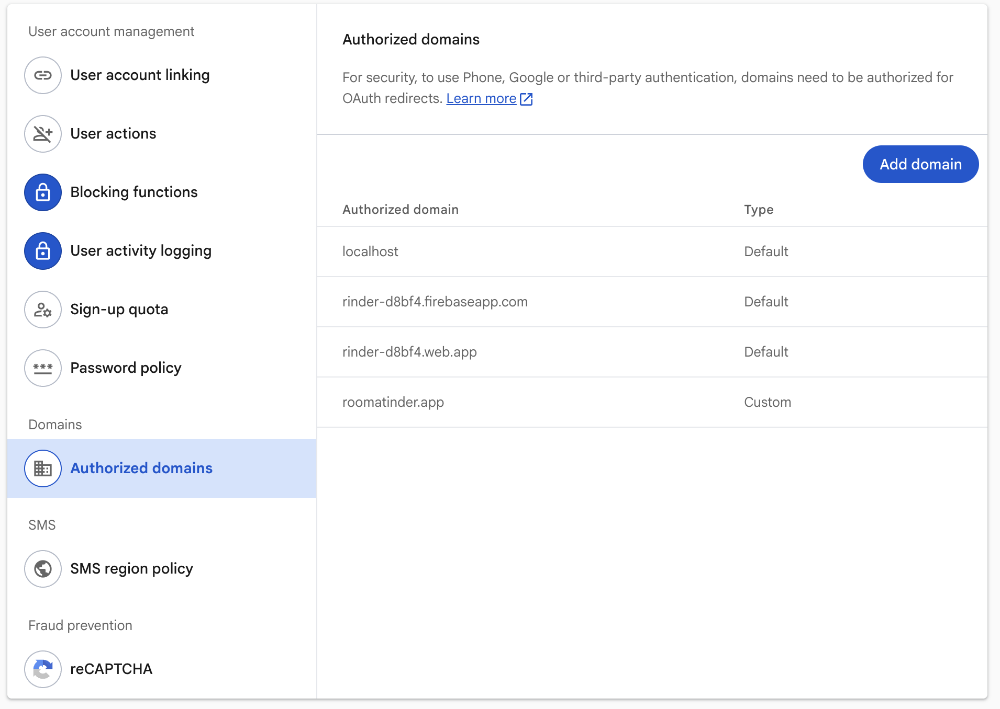

If you are running Roomatinder without a custom domain, enter your external IP address in the **Domain** field and click **Add**.

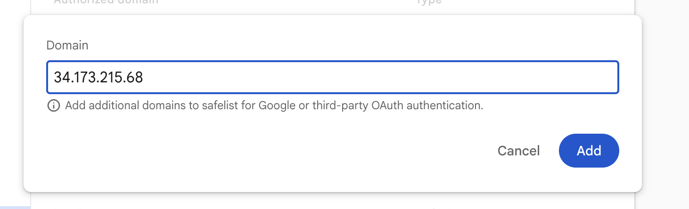

If you are using a custom domain, repeat the process and enter your custom domain:

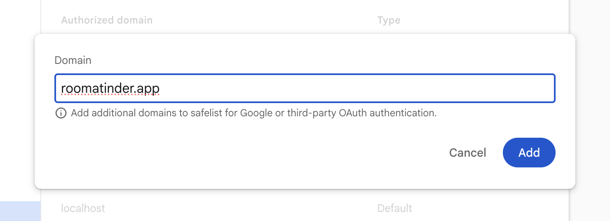

## Updating the Project
To apply updates, perform the following steps from the project root.

1. Stop background services:

```
$ pm2 stop chroma
$ pm2 stop roomatinder
```

2. Retrieve the latest code and rebuild:

```
$ git pull origin main
$ npm run build
```

(If dependencies have changed, run `npm install` before building.)

3. Restart background services:

```
$ pm2 start chroma
$ pm2 start roomatinder
```

Verify that the services are running with `pm2 ls`, and inspect logs using `pm2 logs`.

## Troubleshooting Commands

The project includes several utility scripts for debugging and maintenance:

- `npm run list-documents`: Lists all documents currently stored in ChromaDB. Use this to verify that profiles are present.

- `npm run delete-documents`: Deletes all documents from ChromaDB. This operation is irreversible; use with caution.

- `npm run sync-firebase`: Synchronizes profile data from Firestore into ChromaDB. Useful for populating ChromaDB from Firebase during development.

- `npm run test-email` and `npm run test-match-email`: Send test emails to the address configured in `EMAIL_USER`. Use these commands to verify email configuration and Gemini API integration.
